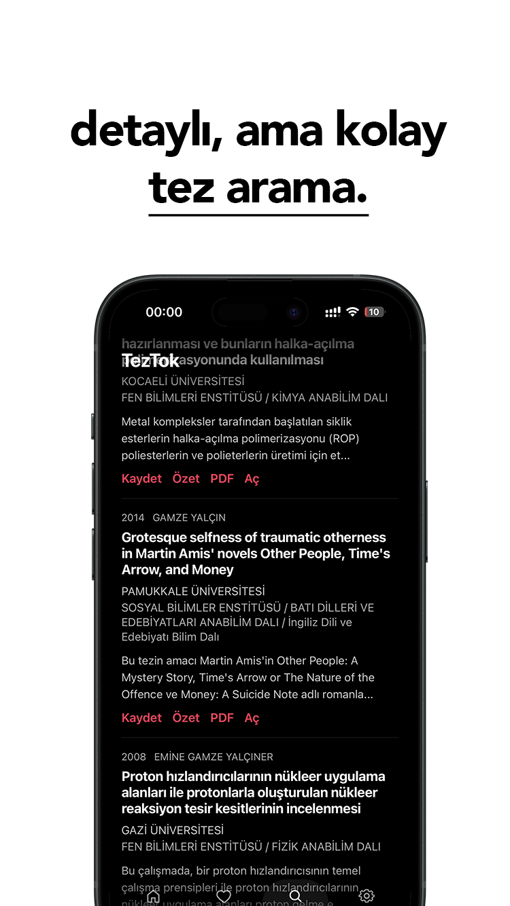
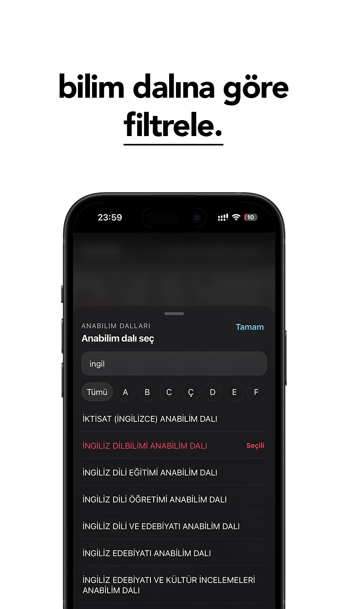
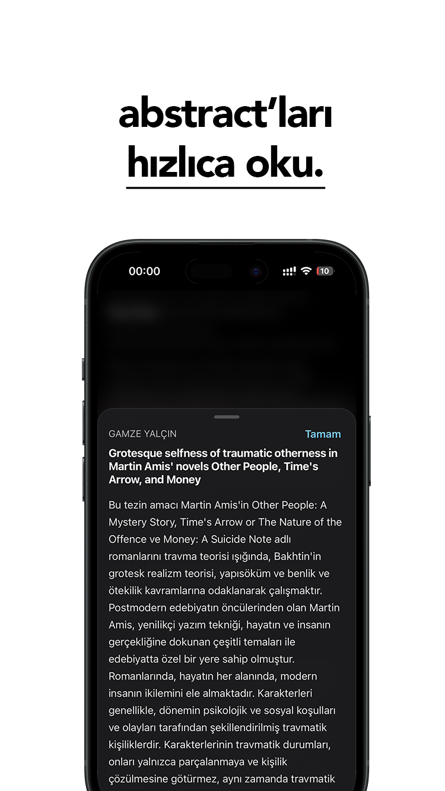
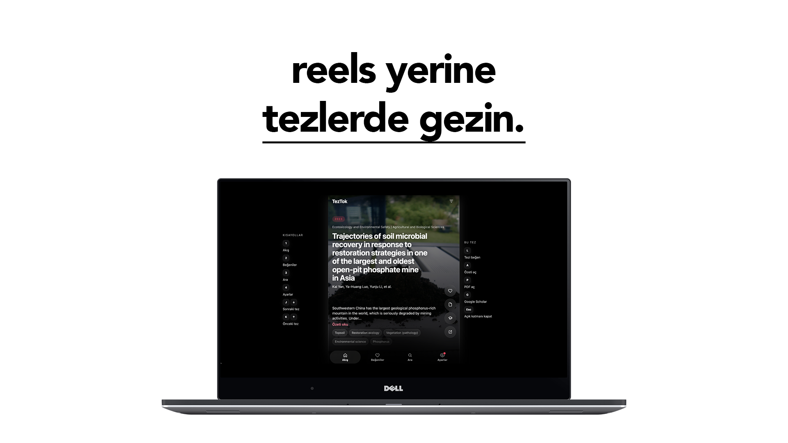
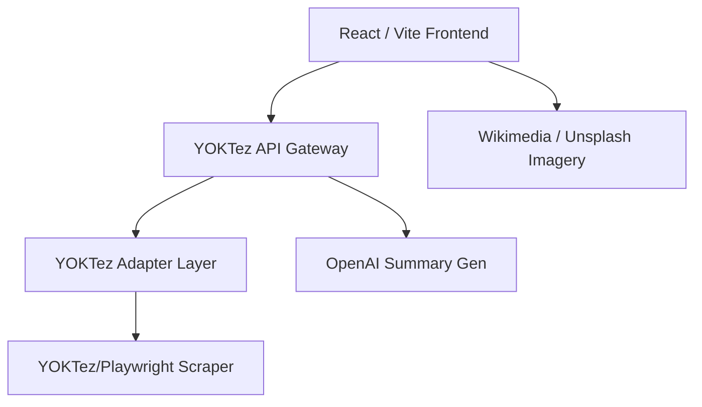

<div align="center">


### *scroll theses instead of reels.*

**Mobile-first academic thesis browsing with a social media style vertical feed.**

[](https://reactjs.org/)
[](https://vitejs.dev/)
[](https://capacitorjs.com/)
[](https://expressjs.com/)
[](https://openai.com/)

---
</div>

## 🚀 Overview

TezTok transforms the often mundane task of browsing academic theses into an engaging, immersive experience. Combining a TikTok-style vertical feed with powerful scraping and AI summary capabilities, it brings academic research to your fingertips.

---

<div>
  <h2>📸 App Gallery</h2>
  <br />
  <table border="0">
    <tr>
      <td></td>
      <td></td>
      <td></td>
    </tr>
  </table>
  <br />
  
  <p><i>Desktop view optimized for widescreen research sessions.</i></p>
</div>

---

<div>
  <h2>🏗️ Architecture</h2>
</div>



---

<div align="center">
  <h2>🛠️ Setup & Development</h2>
</div>

### Prerequisites
- Node.js (>= 20.x)
- npm or yarn

### Installation

```bash
# Clone the repository
git clone https://github.com/yourusername/yoktez-tiktok.git

# Install dependencies
npm install

# Run in development mode (Simultaneous Client & Server)
npm run dev
```

### Environment Configuration

Create a `.env` file in the root directory:

```env
VITE_YOKTEZ_API_BASE_URL=http://localhost:3001
OPENAI_API_KEY=your_openai_key
VITE_UNSPLASH_ACCESS_KEY=your_unsplash_key
```

---

<div>
  <h2>🚢 Deployment</h2>
</div>

### Frontend (Vercel)
The client is ready for Vercel deployment with included `vercel.json` configurations.

### Mobile (Capacitor)
```bash
# Sync with native platforms
npm run cap:sync

# Open in IDE
npm run cap:open:ios
npm run cap:open:android
```

---

<div align="center">
  <p>Developed with ❤️ for the academic community.</p>
</div>
